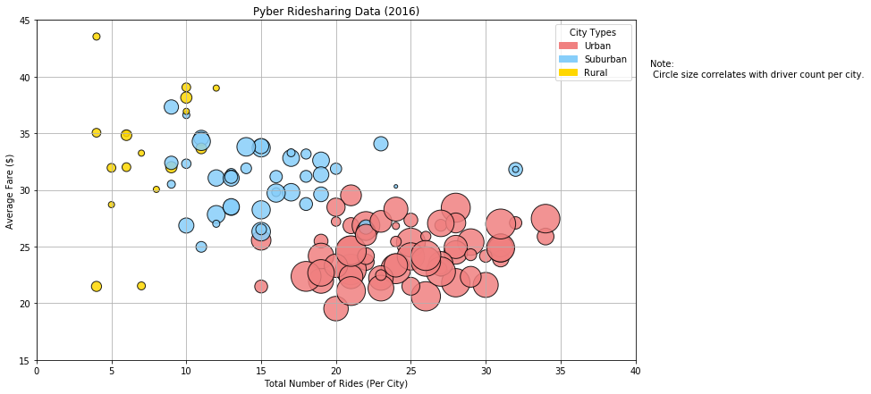
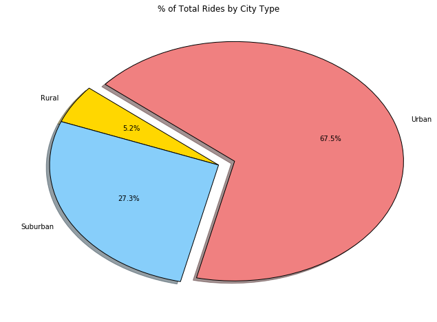
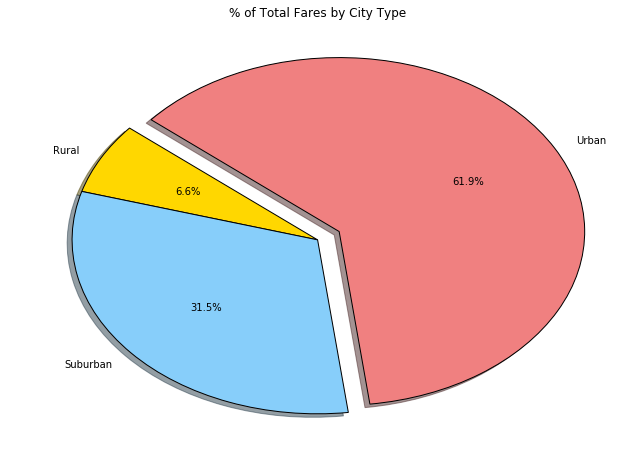
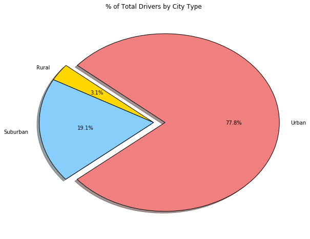

<p><b>Pyber Ride Sharing Data Analysis</b></p>
<p>Trends Noticed:
<p>1. The highest fare on average is earned by drivers in rural cities. </p>
<p>2. Pyber Ride Sharing generates the most revenue in urban cities. </p>
<p>3. The number of drivers present in a city is directly proportionate to the number of rides in a city, and inversely proportionate to the average fare in the city (Most likely due to demand and supply-based pricing).</p>


```python
import matplotlib.pyplot as plt
import pandas as pd
import numpy as np
import os
import scipy
import matplotlib.patches as mpatches


```


```python
path1 = os.path.join("raw_data", "city_data.csv")
df_1 = pd.read_csv(path1)
df_1.head()
```


<div>
<style>
    .dataframe thead tr:only-child th {
        text-align: right;
    }

    .dataframe thead th {
        text-align: left;
    }

    .dataframe tbody tr th {
        vertical-align: top;
    }
</style>
<table border="1" class="dataframe">
  <thead>
    <tr style="text-align: right;">
      <th></th>
      <th>city</th>
      <th>driver_count</th>
      <th>type</th>
    </tr>
  </thead>
  <tbody>
    <tr>
      <th>0</th>
      <td>Kelseyland</td>
      <td>63</td>
      <td>Urban</td>
    </tr>
    <tr>
      <th>1</th>
      <td>Nguyenbury</td>
      <td>8</td>
      <td>Urban</td>
    </tr>
    <tr>
      <th>2</th>
      <td>East Douglas</td>
      <td>12</td>
      <td>Urban</td>
    </tr>
    <tr>
      <th>3</th>
      <td>West Dawnfurt</td>
      <td>34</td>
      <td>Urban</td>
    </tr>
    <tr>
      <th>4</th>
      <td>Rodriguezburgh</td>
      <td>52</td>
      <td>Urban</td>
    </tr>
  </tbody>
</table>
</div>


```python
path2 = os.path.join("raw_data", "ride_data.csv")
df_2 = pd.read_csv(path2)
#df_2.head()
```


```python
city_ride_data = df_2.groupby("city")
ride_data = city_ride_data["fare"].mean()
ride_data = pd.DataFrame(ride_data)
ride_data["Total Number of Rides Per City"] = city_ride_data["ride_id"].nunique()
ride_data.reset_index(inplace=True)
ride_data.rename(columns={"fare":"Average Fare ($) Per City"},inplace=True)

#ride_data.head()

```


```python
final_data = pd.merge(ride_data, df_1, on="city")
final_data.head()
```


<div>
<style>
    .dataframe thead tr:only-child th {
        text-align: right;
    }

    .dataframe thead th {
        text-align: left;
    }

    .dataframe tbody tr th {
        vertical-align: top;
    }
</style>
<table border="1" class="dataframe">
  <thead>
    <tr style="text-align: right;">
      <th></th>
      <th>city</th>
      <th>Average Fare ($) Per City</th>
      <th>Total Number of Rides Per City</th>
      <th>driver_count</th>
      <th>type</th>
    </tr>
  </thead>
  <tbody>
    <tr>
      <th>0</th>
      <td>Alvarezhaven</td>
      <td>23.928710</td>
      <td>31</td>
      <td>21</td>
      <td>Urban</td>
    </tr>
    <tr>
      <th>1</th>
      <td>Alyssaberg</td>
      <td>20.609615</td>
      <td>26</td>
      <td>67</td>
      <td>Urban</td>
    </tr>
    <tr>
      <th>2</th>
      <td>Anitamouth</td>
      <td>37.315556</td>
      <td>9</td>
      <td>16</td>
      <td>Suburban</td>
    </tr>
    <tr>
      <th>3</th>
      <td>Antoniomouth</td>
      <td>23.625000</td>
      <td>22</td>
      <td>21</td>
      <td>Urban</td>
    </tr>
    <tr>
      <th>4</th>
      <td>Aprilchester</td>
      <td>21.981579</td>
      <td>19</td>
      <td>49</td>
      <td>Urban</td>
    </tr>
  </tbody>
</table>
</div>


```python
final_data["coloring"]= final_data["type"]

final_data.loc[:, 'coloring'].replace(["Urban", "Suburban", "Rural"], ["lightcoral", "lightskyblue", "Gold"],
                                      inplace=True)
colors= final_data["coloring"].values

fig = final_data.plot(kind="scatter", x="Total Number of Rides Per City", y="Average Fare ($) Per City", 
              sizes=final_data['driver_count']*16 ,
              grid=True, figsize=(12, 7), 
              color=colors,
              alpha=0.85,
              edgecolors="black",
              #label=np.array['type 0', 'type 1', 'type 2'],
              title="Pyber Ridesharing Data (2016)",
              linewidths=1,legend=True
               )
#print(plt.xlim)
plt.xlim((0, 40))
plt.ylim(15, 45)
plt.xlabel('Total Number of Rides (Per City)')
plt.ylabel('Average Fare ($)')


one = mpatches.Patch(color='lightcoral', label='Urban')
two = mpatches.Patch(color='lightskyblue', label='Suburban')
three = mpatches.Patch(color='Gold', label='Rural')

plt.legend(title="City Types", handles=[one, two, three])

final_data.head()

txt="Note:\n Circle size correlates with driver count per city."
fig.text(41, 40, txt, ha='left')


#final_data.groupby("type")["type"].shape
#Things missing:
# - legend


plt.show()

```





```python
# % of Total Fares by City Type
# % of Total Rides by City Type
# % of Total Drivers by City Type

city_type = final_data.groupby("type")
type_df = {}
type_df["Total Rides"] = city_type["Total Number of Rides Per City"].sum()
type_df["driver_count"] = city_type["driver_count"].sum()
type_df["avg fare"] = city_type["Average Fare ($) Per City"].mean()

type_df = pd.DataFrame(type_df)

type_df["Total fares"] = type_df["Total Rides"]*type_df["avg fare"]
# city_type_df.reset_index(inplace=True)
type_df.head()
```


<div>
<style>
    .dataframe thead tr:only-child th {
        text-align: right;
    }

    .dataframe thead th {
        text-align: left;
    }

    .dataframe tbody tr th {
        vertical-align: top;
    }
</style>
<table border="1" class="dataframe">
  <thead>
    <tr style="text-align: right;">
      <th></th>
      <th>Total Rides</th>
      <th>avg fare</th>
      <th>driver_count</th>
      <th>Total fares</th>
    </tr>
    <tr>
      <th>type</th>
      <th></th>
      <th></th>
      <th></th>
      <th></th>
    </tr>
  </thead>
  <tbody>
    <tr>
      <th>Rural</th>
      <td>125</td>
      <td>34.207143</td>
      <td>104</td>
      <td>4275.892860</td>
    </tr>
    <tr>
      <th>Suburban</th>
      <td>657</td>
      <td>30.962713</td>
      <td>638</td>
      <td>20342.502555</td>
    </tr>
    <tr>
      <th>Urban</th>
      <td>1625</td>
      <td>24.603991</td>
      <td>2607</td>
      <td>39981.484982</td>
    </tr>
  </tbody>
</table>
</div>


```python
one = type_df["Total Rides"]
one = one.plot(kind='pie', figsize=(11, 8), explode=[0,0,0.1], startangle=140, 
               colors=["Gold", "lightskyblue", "lightcoral"],
               shadow=True,
               autopct="%1.1f%%",
               wedgeprops = {'edgecolor' : 'black'} 
              )
plt.title("% of Total Rides by City Type")
plt.ylabel("")
#plt.axis("equal")
plt.show()

```





```python
three = type_df["Total fares"]
three = three.plot(kind='pie', figsize=(11, 8), explode=[0,0,0.1], startangle=140, 
               colors=["Gold", "lightskyblue", "lightcoral"],
               shadow=True,
               autopct="%1.1f%%",
               wedgeprops = {'edgecolor' : 'black'} 
              )
plt.title("% of Total Fares by City Type")
plt.ylabel("")
plt.show()

```





```python
two = type_df["driver_count"]
two = two.plot(kind='pie', figsize=(10, 8), 
               explode=[0,0,0.1], startangle=140, 
               colors=["Gold", "lightskyblue", "lightcoral"],
               shadow=True,
               autopct="%1.1f%%",
               wedgeprops = {'edgecolor' : 'black'} 
              )
plt.title("% of Total Drivers by City Type")
plt.ylabel("")
plt.show()
```




